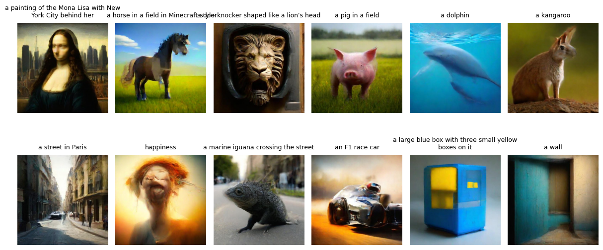
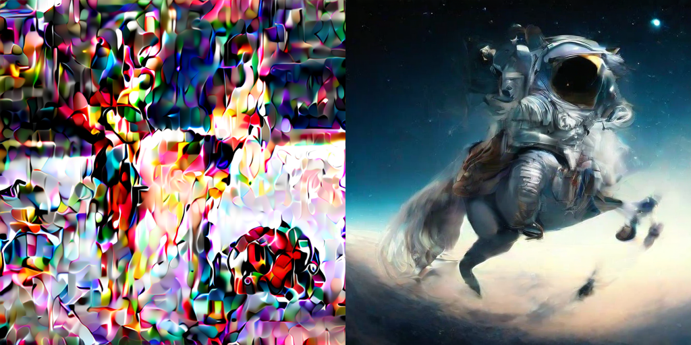

# Consistency distillation

Тестовое задание с обучением consistency дистилляции на основе MicroDiffusion.

## Примеры получившихся генераций

PartiPrompts, 12 случайных промптов, 5 шагов consistency multistep самплера, `cfg=7`:

<figure style="text-align: center;">
  
</figure>

Сравнение с обычным EDM за 5 шагов:

<figure style="text-align: center;">
  
</figure>

## Организация репозитория

Код основан на оригинальном репозитории `micro_diffusion`. Моя имплементация consistency дистилляции находится тут:
[`micro_diffusion.models.model.LatentConsistencyModel`](micro_diffusion/models/model.py).
Кроме обычной consistency дистилляции, также сделан classifier-free guidance из [Latent Consistency Models](https://arxiv.org/abs/2310.04378).

Для загрузки данных и запуска обучения см. оригиналный [`README`](README_orig.md). Для дистилляции использовался 1% JourneyDB (42к картинок).
Учитель и инициализация ученика - [MicroDiT_XL_2 trained on 37M images (22M real, 15M synthetic)](https://huggingface.co/VSehwag24/MicroDiT/resolve/main/ckpts/dit_4_channel_37M_real_and_synthetic_data.pt)
Использованный конфиг: `configs/res_512_finetune_lcm.yaml`. Скрипт для запуска: `distill.sh`.
Обучение занимает около 6 часов на 1xA100 80Gb.

## Sampling

Веса: [yuasosnin/micro_diffusion_consistency](https://huggingface.co/yuasosnin/micro_diffusion_consistency)

```python
from PIL import Image
import numpy as np
from micro_diffusion.models.model import create_latent_cm

model = create_latent_cm(
    vae_name="stabilityai/stable-diffusion-xl-base-1.0",
    text_encoder_name="openclip:hf-hub:apple/DFN5B-CLIP-ViT-H-14-378",
    dit_arch="MicroDiT_XL_2",
    dit_ckpt_path="consistency_dit.pt",
    latent_res=64,
    in_channels=4,
    pos_interp_scale=2.0,
    p_mean=0,
    p_std=0.6,
).to('cuda')
gen_images = model.generate(prompt=['An astronaut riding a horse']*4, num_inference_steps=5, guidance_scale=7.0, seed=2024)

images = gen_images.cpu().unbind(0)
image = images[0].permute(1,2,0).numpy()
Image.fromarray((image*255).astype(np.uint8))
```

## FID ([MS-COCO 30к](https://github.com/boomb0om/text2image-benchmark))

LCM: 159.25

EDM: 12.66

## Ограничения

Результат не самый красивый получается, однако это уже, очевидно, consistency модель (также виден след Midjourney датасета).
Все-таки оригинальная статья дистиллирует в течение 600к шагов с батчом 2048, а я - только 2к с батчем 256.
